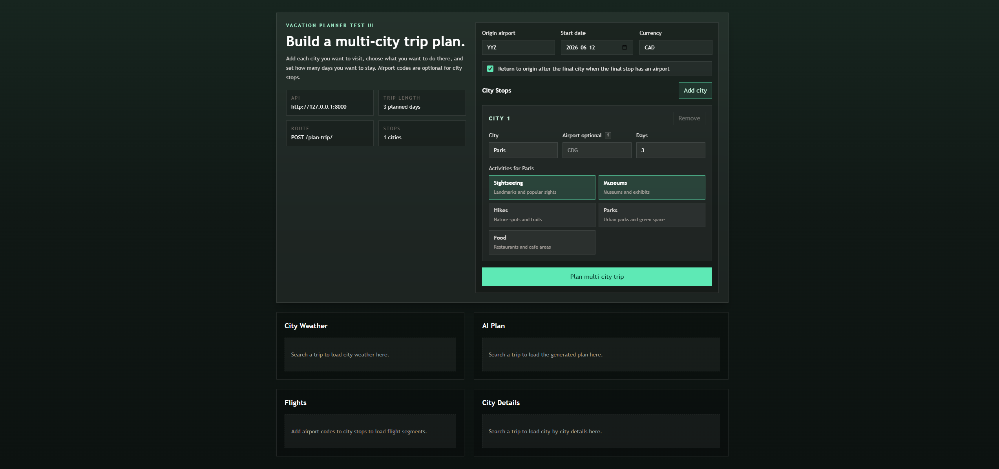

# Vacation Planner AI

An AI-powered vacation planning app for testing multi-city trip planning with flights, hotels, weather, activities, and generated itinerary notes.



## Current Features

- Multi-city trip planning with any number of city stops
- Per-city stay length in days
- Per-city activity preferences, such as sightseeing, museums, hikes, parks, and food
- Optional airport code per city stop
- Flight segment lookup when airport codes are available
- Hotel lookup per city and date window
- Weather lookup per city
- Activity lookup per city using Geoapify
- AI-generated trip plan using Gemini
- React + TypeScript + TailwindCSS frontend
- FastAPI backend with services, routes, and Pydantic schemas

## How Multi-City Planning Works

The frontend sends one request to `POST /plan-trip/`.

Each city stop can include an airport code, but it does not have to. If a city has no airport code, the backend still fetches hotels, weather, and activities for that city. Flight lookup is only attempted for legs where both sides have airport codes.

Example request:

```json
{
  "origin_airport": "YYZ",
  "outbound_date": "2026-06-15",
  "currency": "CAD",
  "return_to_origin": true,
  "include_activities": true,
  "include_weather": true,
  "stops": [
    {
      "city": "Paris",
      "airport": "CDG",
      "days": 3,
      "activity_categories": ["tourism.sights", "entertainment.museum"]
    },
    {
      "city": "Lyon",
      "airport": null,
      "days": 2,
      "activity_categories": ["tourism.sights", "catering.restaurant"]
    }
  ]
}
```

Example response shape:

```json
{
  "trip_data": {
    "origin_airport": "YYZ",
    "start_date": "2026-06-15",
    "end_date": "2026-06-20",
    "currency": "CAD",
    "cities": [],
    "flights": [],
    "hotels": [],
    "activities": [],
    "weather": null,
    "weather_by_city": []
  },
  "ai_plan": "Generated itinerary text"
}
```

## Tech Stack

Frontend:

- React
- TypeScript
- Vite
- TailwindCSS

Backend:

- FastAPI
- Pydantic
- Python

External APIs:

- SerpAPI for Google Flights and Google Hotels
- Open-Meteo for weather
- Geoapify for geocoding and places
- Gemini for AI itinerary generation

## Environment Variables

Create `backend/.env` with:

```env
SERPAPI_KEY=
GEOAPIFY_KEY=
GEMINI_KEY=
ALLOWED_ORIGINS=http://localhost:5173,http://127.0.0.1:5173
```

For local non-Docker testing, you can also allow any frontend origin:

```env
ALLOWED_ORIGINS=*
```

## Running The App

### Docker Compose

From the project root, make sure Docker Desktop is running, then start both services:

```powershell
docker compose up --build
```

Open:

- Frontend: `http://localhost:5173`
- Backend health check: `http://localhost:8000/health`
- Backend docs: `http://localhost:8000/docs`

The Docker setup runs the backend with Uvicorn reload and the frontend with Vite. Local changes in `backend` and `frontend` are mounted into the containers for development.

To stop the app:

```powershell
docker compose down
```

### Local Development

Backend:

```powershell
cd backend
fastapi dev main.py
```

Frontend:

```powershell
cd frontend
npm install
npm run dev
```

The frontend defaults to `http://127.0.0.1:8000` for the backend. To override it, set `VITE_API_BASE_URL`.

## Future Ideas

- Transportation choices per leg, such as train, car rental, bus, or flight
- Smarter handling for cities without airport codes
- Budget and preference controls
- Maps and route visualization
- Saved trips and trip sharing
- User authentication

## Notes

This project is in active development. The frontend is intentionally simple and test-focused so backend changes can be exercised quickly.
